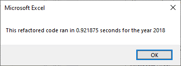

# Stock Analysis with Excel and VBA

## Project Overview

This project compared return percentages for twelve stock listings for 2017 and 2018.  We also investigated the performance change in the calculations when the code was refactored to only loop through the data once to gather the information. 

## Results
The numbers showed that the Total Daily Volumes for the stocks were comparable for each year, but the Returns were vastly different.  The Average Return for 2017 was 67.32%, while 2018 had -8.51%.  Only one stock in 2017 had a negative return, but, in 2018, only two had a positive return.

  &nbsp;&nbsp;&nbsp;&nbsp;&nbsp;&nbsp;     

Refactoring the code as requested resulted in a small savings on processing time.  Although small, this could result in a major reduction when used against a larger dataset.  The original code ran for one second for 2017 and 0.9765625 for 2018.  The run times for the refactored code were 0.9296875 for 2017 and 0.921875 for 2018.

  &nbsp;&nbsp;&nbsp;&nbsp;&nbsp;&nbsp;    
  &nbsp;&nbsp;&nbsp;&nbsp;&nbsp;&nbsp;    

## Summary
Refactoring code can have a major impact on processing time of large qualities of data and it can help to reduce errors.  At the same time, it can add complexity to the code that can be confusing or misleading.  Placing well written comments in stratetic locations in the code file can help explain the code and provide troubleshooting assistance. 

The code in this module was minimal, but was helped by the refactoring of the loop. Adding the comments to the loop functions will aid anyone looking at the VBA code.

